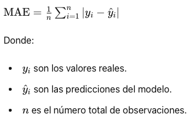
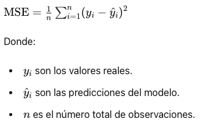

# Análisis de Forecasting para Series Temporales Financieras


## Descripción del Proyecto

**Fuente de Datos:** Datos históricos de precios de cierre de las bases de Yahoo finance.

**Índice bursàtil:** NASDAQ 100 (National Association of Securities Dealers Automated Quotation). Es la segunda bolsa de valores electrónica automatizada más grande de Estados Unidos. Se caracteriza por comprender las empresas de alta tecnología en electrónica, informática, telecomunicaciones, biotecnología, etc.

**Series temporales:** 50 series temporales de las empresas más importantes del indice NASDAQ 100.

**Frecuencia de Datos:** Datos diarios, semanales y mensuales.


## Metodología

1) Preprocesamiento de Datos: Limpieza y normalización de los datos.

2) División de los Datos: División de los datos en conjuntos de entrenamiento, validación y prueba.

3) Entrenamiento: Ajuste de los hiperparámetros y entrenamiento de los modelos.

4) Evaluación de los Modelos: Métricas como MAE y MSE para evaluar la precisión de los modelos.

5) Comparación: Realizaré un análisis comparativo de los resultados obtenidos por cada modelo.


### Modelos

**AutoARIMA**

**Prophet**

**Chronos**


**PatchTST**


## Métricas de evaluación

**Error Absoluto Medio (MAE)**

El MAE se calcula como el promedio de los valores absolutos de los errores entre las predicciones y los valores reales. Es útil porque da una idea de cuán grande es el error promedio del modelo en las mismas unidades que los datos originales.




**Error Cuadrático Medio (MSE)**

El MSE es otra métrica que calcula el promedio de los errores al cuadrado entre las predicciones y los valores reales. Es útil porque penaliza más los errores grandes debido al cuadrado en la fórmula.




## Requisitos

- Python 3.x
- Bibliotecas de Python:
  - pandas
  - numpy
  - matplotlib
  - scikit-learn
  - statsmodels
  - fbprophet

## Instalación

1. Clona este repositorio en tu máquina local:

```bash
git clone https://github.com/Marcos-Heredia-98/GenerativeAI_TimeSeries.git
