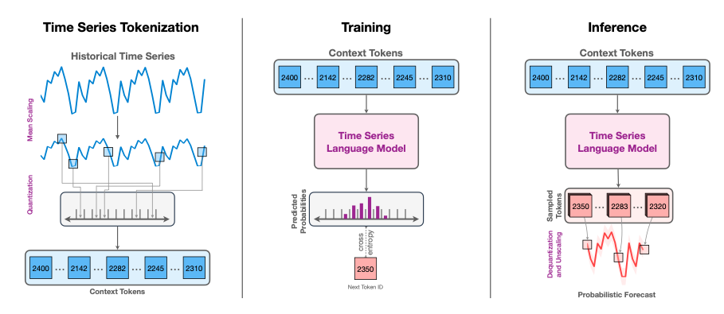
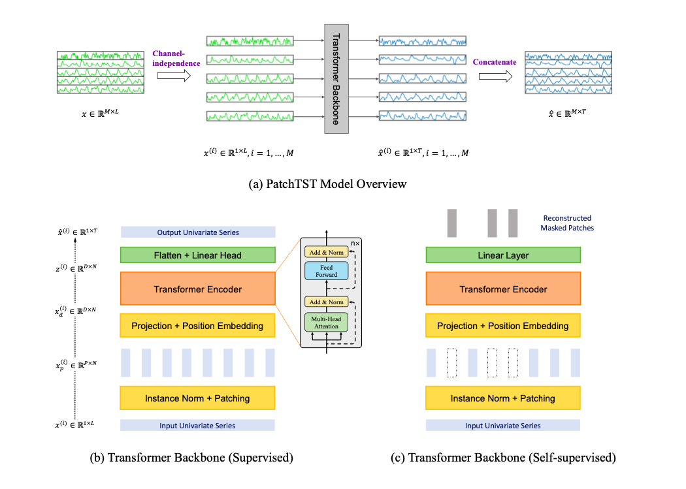

# Análisis de Forecasting para Series Temporales Financieras


## Descripción del Proyecto

**Índice bursàtil:** NASDAQ 100 (National Association of Securities Dealers Automated Quotation). Es la segunda bolsa de valores electrónica automatizada más grande de Estados Unidos. Se caracteriza por comprender las empresas de alta tecnología en electrónica, informática, telecomunicaciones, biotecnología, etc.

**Sector:** Sector Tecnológico

**Horizonte temporal:** 

**Empresas elegidas:** La siguiente lista son las 50 empresas más tecnológicas dentro del índice NASDAQ 100. 

- Apple Inc. (AAPL)
- Microsoft Corporation (MSFT)
- Amazon.com Inc. (AMZN)
- Alphabet Inc. Class A (GOOGL)
- Meta Platforms, Inc. (FB)
- Tesla, Inc. (TSLA)
- NVIDIA Corporation (NVDA)
- Adobe Inc. (ADBE)
- PayPal Holdings, Inc. (PYPL)
- Netflix, Inc. (NFLX)
- Intel Corporation (INTC)
- Cisco Systems, Inc. (CSCO)
- Broadcom Inc. (AVGO)
- Qualcomm Incorporated (QCOM)
- Advanced Micro Devices, Inc. (AMD)
- Zoom Video Communications, Inc. (ZM)
- Texas Instruments Incorporated (TXN)
- Applied Materials, Inc. (AMAT)
- ASML Holding N.V. (ASML)
- Micron Technology, Inc. (MU)
- NXP Semiconductors N.V. (NXPI)
- KLA Corporation (KLAC)
- Intuit Inc. (INTU)
- Marvell Technology, Inc. (MRVL)
- Western Digital Corporation (WDC)
- Skyworks Solutions, Inc. (SWKS)
- Cadence Design Systems, Inc. (CDNS)
- Analog Devices, Inc. (ADI)
- Lam Research Corporation (LRCX)
- Xilinx, Inc. (XLNX)
- Seagate Technology Holdings plc (STX)
- Synopsys, Inc. (SNPS)
- Fortinet, Inc. (FTNT)
- Cognizant Technology Solutions Corporation (CTSH)
- Autodesk, Inc. (ADSK)
- Workday, Inc. (WDAY)
- DocuSign, Inc. (DOCU)
- Palo Alto Networks, Inc. (PANW)
- ServiceNow, Inc. (NOW)
- Splunk Inc. (SPLK)
- Okta, Inc. (OKTA)
- Zebra Technologies Corporation (ZBRA)
- Teradyne, Inc. (TER)
- Atlassian Corporation Plc (TEAM)
- Fiserv, Inc. (FISV)
- Citrix Systems, Inc. (CTXS)
- Align Technology, Inc. (ALGN)
- Synopsys, Inc. (SNPS)
- Microchip Technology Incorporated (MCHP)
- Mettler-Toledo International Inc. (MTD)


### Modelos

**AutoArima:**

AutoArima es una implementación automática del modelo ARIMA (Autoregressive Integrated Moving Average). ARIMA es ampliamente utilizado para modelar y predecir series temporales, especialmente aquellas que muestran patrones estacionales y tendencias. AutoArima selecciona automáticamente los parámetros óptimos del modelo ARIMA mediante métodos estadísticos.

Características Principales:

- Identificación automática de los parámetros p, d y q del modelo ARIMA.
- Manejo automático de estacionalidad mediante diferenciación estacional.


**Prophet:**

Prophet es un modelo de forecasting desarrollado por Facebook que está diseñado específicamente para manejar series temporales que exhiben estacionalidad diaria, semanal o anual, así como efectos de días festivos. Utiliza un modelo aditivo donde las tendencias no lineales se ajustan a los efectos estacionales y las vacaciones.

Características Principales:

- Capacidad para manejar datos faltantes y cambios en la tendencia.
- Modelo intuitivo con ajuste automático de efectos estacionales y vacaciones.

**Chronos:**

Chronos es un modelo avanzado de series temporales desarrollado por Uber AI Labs. Está diseñado para manejar datos multivariados y capturar relaciones complejas entre múltiples series temporales. Chronos utiliza una arquitectura de redes neuronales recurrentes (RNN) para aprender patrones secuenciales y temporales.

Características Principales:

- Modelo basado en redes neuronales recurrentes (RNN).
- Capacidad para capturar dependencias temporales complejas entre múltiples series.




**PatchTST:**

PatchTST es un enfoque reciente para el forecasting de series temporales que se centra en transformaciones en el dominio del tiempo. Este modelo busca mejorar la capacidad predictiva al aplicar transformaciones no lineales a las series temporales originales.

Características Principales:

- Enfoque innovador que utiliza transformaciones en el dominio del tiempo.
- Capacidad para capturar patrones no lineales y mejorar la precisión predictiva.




## Requisitos

- Python 3.x
- Bibliotecas de Python:
  - pandas
  - numpy
  - matplotlib
  - scikit-learn
  - statsmodels
  - fbprophet

## Instalación

1. Clona este repositorio en tu máquina local:

```bash
git clone https://github.com/Marcos-Heredia-98/GenerativeAI_TimeSeries.git
